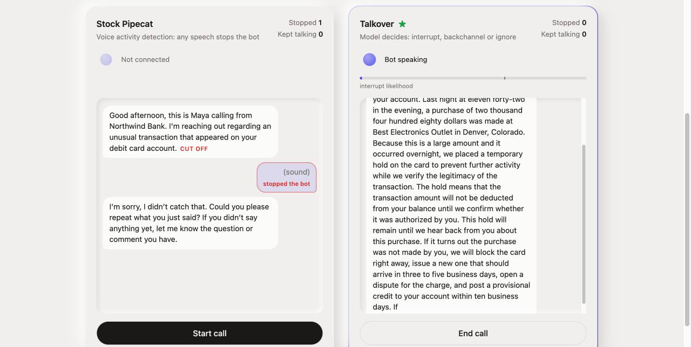
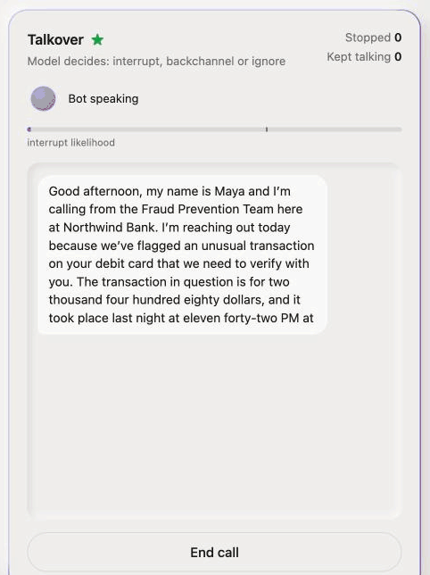
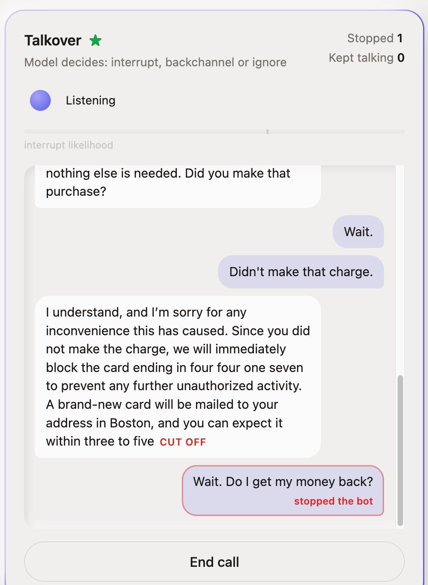

# Talkover

While a voice agent is talking and the caller makes a sound, the agent has to
decide within a few hundred milliseconds whether to stop. Stock agents use
voice activity detection (VAD) and stop on almost any sound: "mm-hmm", a
cough, the TV, their own echo.

Talkover is a small streaming audio model that labels that moment as
**interrupt** (stop), **backchannel** (keep talking) or **ignore** (keep
talking). It hears the caller and the agent's own audio, decides every
100 ms, and runs on CPU.

> **An open, CPU-only interruption classifier: it cuts voice-agent false stops
> 2–4× versus standard voice detection and drops into Pipecat in two lines.**
>
> Measured on human-to-human speech (AMI meetings, TurnBench calls). On calls
> with a TTS agent it currently matches VAD; in-domain training data is the
> next step.

## Demo

A fraud-check call from a fictional bank, taken twice with the same voice
agent: stock Pipecat on the left, Talkover on the right. Only the
interruption logic differs. All captures are real calls in the
[live demo](#live-demo); the caller sounds were played through the laptop
speakers.



*Same call, same background noise (one real run). Stock Pipecat is cut off
and asks the caller to repeat; Talkover keeps talking.*

<p>
  
  
</p>

*A real interruption still stops the agent: "Wait. Do I get my money back?"
cuts it off mid-sentence, and it answers the question. The caller's voice is
macOS text-to-speech.*

Live, Talkover's clearest edge today is background noise and fast reaction to
real interruptions. With the demo's synthetic agent voice it still stops for
many "mm-hmm"s; see the TTS-agent row in the results below.

## Results

Stop rates 500 ms after the caller's sound. Interrupt should be high; the rest
low. Full tables and confidence intervals are in
[`experiments/results/interruption_summary.md`](experiments/results/interruption_summary.md).

| Test set | Policy | Interrupt | Backchannel | Ignore | Stops before the caller speaks |
|---|---|---|---|---|---|
| AMI meetings, noise added | Silero VAD | 0.88 | 0.74 | 0.35 | 0.34 |
| | Talkover | 0.80 | 0.18 | 0.04 | 0.01 |
| TurnBench dev, human calls | Silero VAD | 0.77 | 0.70 | 0.03 | 0.12 |
| | Talkover | 0.81 | 0.37 | 0.02 | 0.05 |
| Own calls with a TTS agent (held-out) | Silero VAD | 0.68 | 0.73 | 0.00 | – |
| | Talkover | 0.68 | 0.53 | 0.07 | – |

- On human audio, Talkover stops for 2-4x fewer backchannels and far fewer
  noises and echoes than VAD at similar recall, and catches interrupts sooner.
- **Known limitation:** with a TTS agent it matches VAD's recall with fewer
  backchannel stops but slightly more noise stops; overall it is not yet a
  clear win. The ablations behind this are in
  [`interruption_agent_calls.md`](experiments/results/interruption_agent_calls.md).
  The next lever is training data of people talking over TTS agents.
- Calibrate the decision threshold on a few labelled calls from your own
  setup; the threshold does not transfer unchanged across agents.

## Use it with Pipecat

```bash
uv pip install -e '.[pipecat]'
.venv/bin/python scripts/interruption/package_model.py      # bundle: model.onnx + bundle.json
```

```python
from pipecat.turns.user_turn_strategies import UserTurnStrategies
from talkover.integrations.pipecat import AgentAudioTap, TalkoverInterruptionStrategy
from talkover.interruption.runtime import InterruptionDetector

detector = InterruptionDetector.from_bundle("data/release/talkover")
user_turn_strategies = UserTurnStrategies(start=[TalkoverInterruptionStrategy(detector=detector)])

pipeline = Pipeline([
    transport.input(), stt, user_aggregator, llm, tts,
    transport.output(),
    AgentAudioTap(detector),        # after output: the agent audio as it is played
    assistant_aggregator,
])
```

- While the bot speaks, the model decides whether the caller is interrupting
  (checked every 100 ms on the last second of caller and agent audio).
  While the bot is silent, VAD starts the user turn as usual.
- Use it as the only start strategy; a VAD or transcription start strategy in
  the same list would bypass the model.
- The caller audio should be echo-cancelled (WebRTC clients and Daily do this).
- Calibrate on a few labelled calls from your own agent:
  `scripts/interruption/calibrate.py --bundle ... --clips ... --write`.
- `scripts/interruption/replay_call.py` streams a recorded call through the
  detector and prints when it would stop the agent.

## Live demo

Two copies of the same voice bot in the browser: stock Pipecat on the left,
Talkover on the right. Talk over each one and compare what it does.

```bash
uv pip install -e '.[demo]'
# .env: DEEPGRAM_API_KEY=... and GROQ_API_KEY=...
.venv/bin/python demo/server.py    # http://localhost:7860
```

Deepgram does speech-to-text and the bot's voice; Groq (`gpt-oss-20b`) writes
the story. Both sides share every component except the turn start strategy.

## Model

Whisper-tiny encoder (fine-tuned) over caller and agent streams, a learned
layer mix and a GRU head. 9.0M parameters, ONNX INT8 13.4 MB, about 5 ms per
decision on an Apple CPU and about 21 ms on one x86 vCPU. Trained on the AMI
meeting corpus with noise, echo and telephony augmentation, half of the clips
with the agent re-voiced by TTS. A 95M WavLM teacher is used only during
development.

## Setup

Python 3.11+ and [uv](https://docs.astral.sh/uv/).

```bash
uv venv --python 3.12
uv pip install -e '.[dev,interruption,vad]'
.venv/bin/python -m pytest
```

Extras: `runtime` (detector only), `pipecat`, `interruption` (data and training), `vad` and `asr` / `asr-mlx`
(baselines), `export` (ONNX), `verify` (DNSMOS and BEATs checks),
`agent-calls` (recording and echo cancellation).

Datasets, clips, weights and results live in `data/` (git-ignored; override
with `TALKOVER_DATA_DIR`). GPU training runs on Modal; see
[`infra/README.md`](infra/README.md).

## Pipeline

| Step | Scripts (`scripts/interruption/`) |
|---|---|
| AMI events and clips | `download_ami_audio.py`, `build_overlap_events.py`, `extract_clips.py` |
| Augmented eval sets and checks | `render_eval_set.py`, `verify_eval_set.py` |
| TTS-voiced agent clips | `build_tts_agent_clips.py` |
| TurnBench clips | `build_turnbench_clips.py` |
| Own agent calls | `record_agent_session.py`, `label_agent_session.py` |
| Baselines | `run_baselines.py`, `summarize_baselines.py` |
| Train, evaluate, export | `train_interruption.py`, `evaluate_interruption.py`, `heldout_eval.py`, `export_onnx.py` |
| Ship and calibrate | `package_model.py`, `calibrate.py`, `replay_call.py` |

## Layout

```text
src/talkover/
|-- interruption/   events, labelling, augmentation, policies, benchmark, runtime
|   |-- corpora/    AMI, TurnBench and self-recorded agent calls
|   `-- model/      windows, network, checkpoints, streaming scorer
|-- integrations/   Pipecat strategy and agent-audio tap
|-- evaluation/     intervals and cluster-bootstrap confidence intervals
`-- verification/   DNSMOS and BEATs checks of the eval sets
scripts/interruption/   command-line entry points
infra/modal/            GPU training and evaluation on Modal
experiments/results/    measured results, one file per study
demo/                   side-by-side live demo (Pipecat + browser)
tests/
```

Third-party models and datasets: [NOTICE.md](NOTICE.md).
